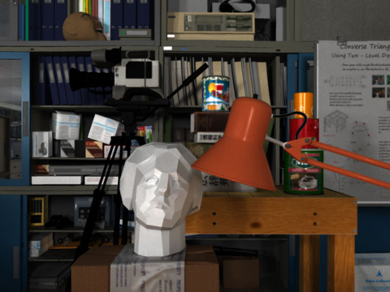

<!DOCTYPE html>
<html lang="en">
<head>
    <meta charset="UTF-8">
    <meta name="viewport" content="width=device-width, initial-scale=1.0">
    <title>Report</title>
    <link rel="stylesheet" href="report.css">
</head>
<body>
    

        
    

    

    <h1>Ψηφιακή Επεξεργασία Εικόνας</h1>
    

    
    <h3>Εργασία 1: Βελτίωση Εικόνων μέσω εξισορρόπησης ιστογράμματος</h3>
    <h3><i>Παπαδημητρίου Δημήτρης : 6995</i></h3>
    <h4>21/4/2024</h4>
</body>
</html>